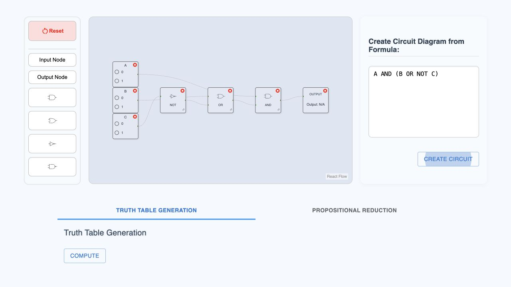
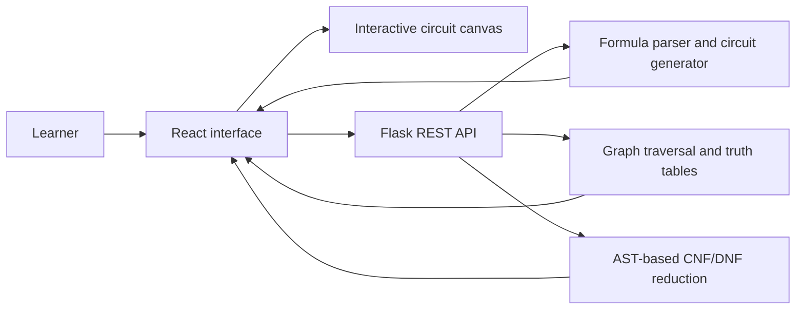

# LogiDex

**An interactive workspace for building logic circuits and moving between circuit diagrams, truth tables, and propositional formulas.**

LogiDex turns abstract Boolean logic into something learners can manipulate. Users can draw circuits from seven standard gate types or enter a formula and generate a neatly arranged circuit automatically. The same circuit can then be explored as a live signal flow, a filterable truth table, or a step-by-step CNF/DNF reduction.



> This repository is being prepared as a public portfolio release of my final-year BSc Computer Science project at King's College London.

## Why I built it

Students often encounter propositional logic as symbols and manual calculations before they can develop an intuition for how the values move through a circuit. LogiDex was designed around three goals: experimental freedom, educational explanation, and accessibility for both beginners and more experienced users.

I designed the interface, implemented the React application and Flask API, built the circuit and formula algorithms, and evaluated the finished tool through automated and user testing.

## What it can do

- Build circuits interactively with `AND`, `OR`, `NOT`, `NAND`, `NOR`, `XOR`, and `XNOR` gates.
- Toggle inputs and see values propagate through colour-coded nodes in real time.
- Inspect a gate's behaviour through an embedded mini truth table.
- Convert formulas such as `A AND (B OR NOT C)` into automatically arranged circuit diagrams.
- Validate incomplete or invalid circuits before computation and return specific guidance.
- Generate complete truth tables, highlight the active input combination, filter columns, and progressively reveal large results.
- Derive a propositional formula from a circuit and show CNF and DNF transformations step by step.
- Guide first-time users through the interface with an interactive tutorial.

## Architecture



The frontend owns immediate interaction, canvas state, visual feedback, filtering, and presentation. The Python backend exposes three stateless endpoints for formula-to-circuit parsing, truth-table generation, and propositional reduction. The production build is served by the same Flask service, so the complete application can be deployed as one container.

## Deploy

The repository includes deployment configuration for both Vercel and Render. On Vercel, import the repository with the repository root selected; `vercel.json` installs and builds the Vite frontend before the root Flask entry point serves the application and API from one deployment. No separate frontend or backend project is required.

The included `Dockerfile` and `render.yaml` provide the equivalent container-based deployment path on Render.

## Run locally

### Requirements

- Python 3.10+
- Node.js 20+
- npm

Install everything from the repository root:

```bash
npm run setup
```

Then start the React development server and Flask API together:

```bash
npm start
```

Open `http://localhost:3000`. Press `Ctrl+C` once to stop both processes.

### Production-style local run

```bash
npm run build
npm run serve
```

Open `http://localhost:5050`. Flask will serve both the API and the compiled React application.

## Project structure

```text
backend/             Flask API, logic algorithms, and Python tests
frontend/src/api/    Typed-by-convention API boundary
frontend/src/components/
                     Focused interface components
frontend/src/config/ Gate definitions and shared constants
frontend/src/hooks/  Circuit editor state and interactions
frontend/src/utils/  Validation, serialization, and layout algorithms
scripts/             Cross-platform setup and run commands
app.py               Vercel Flask entry point
vercel.json          Vercel build configuration
```

## Tests

The repository contains **45 backend and frontend tests** covering:

- Formula parsing, precedence, nesting, and invalid syntax
- Formula-to-circuit generation
- Gate evaluation and truth-table generation
- AST construction and Boolean simplification
- CNF and DNF transformation steps
- End-to-end circuit/formula workflows
- Circuit validation, connection ordering, and generated layout

Run them from the repository root:

```bash
npm test
```

## Technical highlights

### Formula-to-circuit conversion

A recursive-descent parser validates expressions, respects parentheses and operator precedence, and converts formulas into nodes and connections. A breadth-first layout pass assigns each generated node to a logical depth, producing a readable left-to-right circuit.

### Truth-table computation

The backend constructs a directed graph from the circuit and evaluates every binary input combination using dependency-aware traversal. The frontend highlights the user's active combination and supports compound column filters without storing user data on the server.

### Explainable normal-form reduction

The propositional-reduction engine represents formulas as an abstract syntax tree. It applies De Morgan's laws, simplification, and distribution while preserving the surrounding tree context, allowing the interface to display complete before-and-after formulas for each CNF or DNF step.

## Evaluation

The original university project included iterative usability testing with 10 participants. In that evaluation, interactions were observed at approximately 150-200 ms, circuits with up to 50 nodes were exercised without noticeable lag, and participant feedback informed the final tutorial, validation messages, layout, and accessibility improvements.

The current portfolio release has also been checked with the full automated test suite and an optimised frontend production build.

## Technology

`React` · `Vite` · `React Flow` · `Material UI` · `JavaScript` · `Python` · `Flask` · `REST APIs` · `Graph traversal` · `Abstract syntax trees` · `Docker`

## Privacy and academic context

LogiDex does not require accounts or a database. Circuit information is processed for the current request and is not intentionally persisted by the backend. The original dissertation PDF is deliberately excluded from this public repository because its cover contains a student identifier; a redacted technical report can be added separately.

## Future work

- Multiple circuit outputs and reusable custom gates
- Multi-input compound gates
- A dedicated guided-learning mode with answer verification
- High-contrast and dark themes
- Broader end-to-end interaction and accessibility coverage

## Author

Created by [Shreeya Chandel](https://www.linkedin.com/in/shreeyachandel/).
